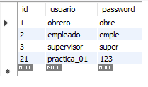

# API REST con Spring Boot 4
Este proyecto implementa una API REST utilizando Spring Boot 4 y MySQL como base de datos. La API permite realizar operaciones CRUD (Crear, Leer, Actualizar, Eliminar) sobre la entidad Usuarios.

## Tecnologías Utilizadas:

- Spring Boot 4: Framework de desarrollo de aplicaciones Java.
- MySQL: Sistema de gestión de bases de datos relacional.
- API REST: Utilizada para la comunicación entre el frontend y el backend mediante HTTP.

## Componentes Clave:
 
### Modelo (Usuarios):

- Clase Java que representa la entidad usuarios en la base de datos.
- Anotada con @Entity para indicar que es una entidad JPA y @Table para especificar el nombre de la tabla en la base de datos.
- Propiedades como id, usuario, y password con anotaciones como @Id, @GeneratedValue, y @Column para mapear las columnas de la tabla.

### Repositorio (IUsuarios):

Interfaz que extiende CrudRepository de Spring Data, proporcionando métodos estándar para operaciones CRUD en la entidad Usuarios.

### Controlador REST (RestUsuario):

- Controlador RESTful que maneja las solicitudes HTTP para la entidad Usuarios.
- Anotado con @RestController y @RequestMapping("/rest_usu") para definir la raíz de las URL de la API.
- Métodos HTTP (GET, POST, PUT, DELETE) para las operaciones CRUD:
   - GET /listar: Retorna todos los usuarios.
   - GET /buscar/{id}: Retorna un usuario específico por su ID.
   - POST /insertar: Inserta un nuevo usuario.
   - PUT /modificar: Modifica un usuario existente.
   - DELETE /eliminar/{id}: Elimina un usuario por su ID.

### Configuración de la Aplicación (application.properties):

- Configuración de la aplicación Spring Boot, incluyendo el nombre (spring.application.name) y el puerto del servidor (server.port).
- Configuración de la conexión a la base de datos MySQL (spring.datasource.url, spring.datasource.username, spring.datasource.password).
- Configuración adicional de Hibernate para la generación automática del esquema de la base de datos (spring.jpa.hibernate.ddl-auto).

## Uso de la API:
- Puedes acceder a las diferentes operaciones para interactuar con la siguiente tabla Usuarios:
- 
  - GET http://localhost:9898/rest_usu/listar: Retorna todos los usuarios.
  - 
  - GET http://localhost:9898/rest_usu/buscar/{id}: Retorna un usuario específico por su ID.
  - 
  - POST http://localhost:9898/rest_usu/insertar: Inserta un nuevo usuario.
  - 
  - 
  - PUT http://localhost:9898/rest_usu/modificar: Modifica un usuario existente.
  - 
  - 
  - DELETE http://localhost:9898/rest_usu/eliminar/{id}: Elimina un usuario por su ID.
  - 
  - 
